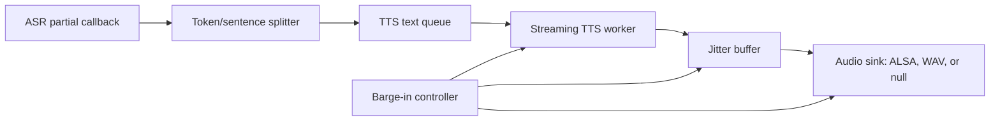

# Architecture

## Mục tiêu

Pipeline được tách thành các worker độc lập để giữ độ trễ thấp và tránh chặn audio thread:

## Luồng xử lý

1. ASR trả về partial text liên tục.
2. `SentenceSplitter` quét phần text mới. Khi gặp `, . ? ! ; :` và segment đủ `split_min_tokens`, nó phát segment ngay sang TTS queue. Nếu partial dài quá `split_max_tokens`, splitter cắt mềm tại cụm hợp lý gần nhất để không giữ text quá lâu.
3. TTS worker nhận segment và sinh PCM chunk streaming. Bản scaffold dùng sine PCM để benchmark cơ chế luồng; adapter TTS thật chỉ cần thay hàm sinh chunk.
4. Jitter buffer gom trước một lượng nhỏ PCM, mặc định 60 ms, rồi audio worker phát liên tục.
5. Audio worker dùng `snd_pcm_writei` khi chạy `--audio=alsa`. Trong Docker không có loa, dùng `--audio=null` để đo scheduling và queue timing.
6. Barge-in tăng epoch hủy TTS hiện tại, xóa text queue, xóa jitter buffer và gọi `snd_pcm_drop`/`prepare` ở ALSA sink.

## Điểm thay thế bằng model thật

- ASR: thay `asr_simulator` bằng callback từ Zipformer hoặc Whisper streaming.
- TTS: thay `generate_pcm_chunk` bằng Valtec-TTS streaming chunk generator.
- Splitter: hiện dùng punctuation hard boundary, soft boundary theo cụm từ và ngưỡng token. Khi có timestamp/voice activity từ ASR thật, thêm soft boundary theo pause 300-500 ms và confidence ổn định.

## Thread synchronization

- Text queue và jitter buffer là blocking queue có `mutex`, `condition_variable`, `close`, `clear`.
- Splitter giữ `emitted_pos` và tập segment đã emit để tránh gửi trùng khi ASR lặp hoặc sửa partial.
- Barge-in dùng atomic `epoch`. TTS kiểm tra epoch trước mỗi PCM chunk để không phát tiếp phản hồi cũ.
- Audio worker kiểm tra `flush_requested` trước mỗi write. Với period 20 ms, đường flush có thể phản ứng dưới 200 ms nếu ALSA device không bị block bất thường.
