# Kien truc trien khai AI Edge Assistant

Tai lieu nay bam theo de bai "AI Edge so 2": always-on VAD, ring buffer, producer-
consumer ASR va TTS code-switching tren Raspberry Pi 5.

## 1. Luong tong the

```mermaid
flowchart LR
    MIC["Microphone / simulated audio"] --> RB["Fixed ring buffer 3s"]
    RB --> VAD["VAD: Energy fallback / Silero / WebRTC"]
    VAD -->|"speech segment"| Q["Thread-safe Queue bounded"]
    Q --> ASR["ASR worker: SenseVoiceSmall adapter"]
    ASR --> TN["Text normalization / phonemizer"]
    TN --> TTS["TTS: Valtec/VieNeu adapter"]
    TTS --> OUT["Speaker / dashboard alert"]
```



## 2. Threading model

Producer thread:

- Doc audio theo frame 20 ms, 16 kHz, PCM16 mono.
- Ghi moi frame vao ring buffer co dung luong co dinh 3 giay.
- Chay VAD nhe tren tung frame.
- Khi VAD co speech lien tiep du `speech_start_ms`, bat dau gom segment, kem pre-roll
  trong ring buffer.
- Khi im lang du `speech_end_ms`, day segment vao queue.
- Neu segment qua `max_utterance_ms`, cat segment bang `vad_timeout` de queue khong bi
  treo vi nguoi dung noi qua dai hoac moi truong qua on.

Consumer thread:

- `queue.get(timeout=0.05)` nen khong block cung toan bo he thong.
- Chi thuc day khi queue co segment speech.
- Goi ASR, sau do text-normalization/phonemizer, sau do TTS.
- Ghi latency ASR/TTS/end-to-end de benchmark.

## 3. Ring buffer

`FixedSizeRingBuffer` dung `bytearray` co kich thuoc co dinh:

```text
capacity = sample_rate * 2 bytes * ring_buffer_seconds
         = 16000 * 2 * 3 = 96000 bytes
```

Do do he thong chay nhieu gio van khong co list audio tang vo han. Snapshot duoc tra ve
theo thu tu thoi gian dung de them pre-roll khi VAD bat dau speech.

## 4. Backpressure

Queue duoc gioi han boi `queue.max_segments`. Khi full:

- `drop_oldest`: giu canh bao moi nhat, bo segment cu. Phu hop dashboard/canh bao xe.
- `drop_newest`: bao toan segment dang cho xu ly, bo speech moi.
- Timeout ngan `put_timeout_ms` giup producer khong bi block dai.

Tac dung phu cua `drop_oldest`: co the mat mot phan cau noi cu neu ASR qua cham. Bu lai,
he thong khong bi treo va canh bao gan thoi gian thuc van duoc uu tien.

## 5. TTS code-switching

Voi model TTS duoi 100M parameters, khong nen nhung lexicon tieng Anh khong lo vao model.
Giai phap mac dinh la xu ly o tang text-normalization/phonemizer:

- Acronym co gioi han mien ung dung: `BMS -> bi em et`, `ASR -> ay es ar`,
  `CAN -> can`.
- Don vi ky thuat: `24V -> hai muoi bon von`.
- Tu ky thuat tieng Anh pho bien: `Overcurrent`, `communication`, `timeout`.
- Cho phep bo sung rule theo domain EV/dashboard ma khong retrain model.

Uu diem:

- CPU gan nhu khong dang ke so voi ASR/TTS inference.
- Cap nhat rule nhanh tren Pi.
- Khong lam tang parameter/model size.

Nhuoc diem:

- Can curate danh sach thuat ngu.
- Mot so tu moi co the phat am chua tu nhien neu chua co rule.

## 6. Prosody control

Canh bao khan cap duoc dieu khien bang metadata:

- `urgent_speed`: toc do doc nhanh hon.
- `urgent_pitch`: cao do cao hon.

Voi Valtec-TTS/VieNeu-TTS, nen map hai tham so nay vao tham so runtime san co cua
model/vocoder. Tranh them model phu hoac pass inference thu hai, vi nhu vay se lam tang
latency active mode.

## 7. Backend thay the

Ban hien tai chay mock de benchmark pipeline:

- `EnergyVAD`: fallback khong dependency.
- `MockASR`: placeholder cho SenseVoiceSmall.
- `MockTTS`: placeholder cho Valtec-TTS/VieNeu-TTS.

Khi len Pi, giu nguyen interface va thay implementation trong `edge_assistant/vad.py`,
`edge_assistant/asr.py`, `edge_assistant/tts.py`.
